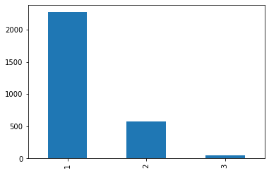
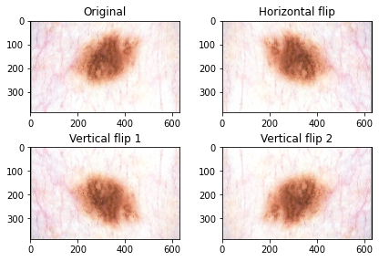

# Skin Cancer Detection


Challenge realized [@BeCode](http://www.becode.org)

- Type of Challenge: `Consolidation`
- Duration: `5 days`

## The team

- [Andreas Markgraf](https://github.com/andypendent)
- [Christian Melot](https://github.com/Ezamey)
- [Ebukebir Kocadag](https://github.com/EbubekirKocadag)
- [Jérôme Coumont](https://github.com/jcoumont)
- [Pierre Wasilewski](https://github.com/Wasilp)

## The Mission

The health care company "skinCare" hire you as a freelance data scientist for a short mission.
As they pay you an incredible amount of money you accept. Here is the mail you receive:

```
from: sales.skincare.be@gmail.com
to:   projects@becode.org

Hi,

At skinCare we have more and more demands from companies for a tool that would be able to detect moles that need to be handle by doctors.

You mission, if you accept it, would be to do an AI that can detect when the mole is dangerous. To be able to use your AI, we want you to create a simple web page where the user could upload a picture of the mole and see the result.

We don't have a web dev department in our company you will need to handle the UI as well, we don't care about having something amazing on the design side, we just want a proof of concept to show our client that the product has potential. You are free in the technology you want to use.

You will also need to put your application on the internet so we can use it. Our IT department asks you to use "Docker" so they can "deploy" it on their own afterward without your help. I guess you know what does it mean.

You will find attached to this email the data you need.

If you have any question, feel free to reply to this mail or to send a mail to our department at the email address: sales.skincare.be@gmail.com

Good luck,
skinCare sales team
```

## The solution proposed

To achieve this mission we decided to propose to our fictive client two different solutions : a website and a smartphone application

A such approach can offer more flexibility to the final user when he is worried by the aspect of a mole.

### Website

Via a really basic form integrated into the website, the final user can easily post a photo of his mole and have a rapid prediction.

### Smartphone application

By using the smartphone application, the final user can use his phone camera to view a real time prediction of the mole in the displayed area.

## The process

This AI implementation is based on a datasource containing **2.900 images** of moles distributed into **3 categories**:

- 1 : begnin mole
- 2 : malign mole (low risk)
- 3 : malign mole (high risk)




Given the low number of cases 3, we preferred to classify them under 2 main classes **begnin/malignant**.
Despite this grouping, the data are still unbalanced. So we generated additional malignant images by performing vertical and horizontal rotations.
After this image transformation, we have a total of **4787 images** (2271 begnin and 2516 malign).




## Installation


